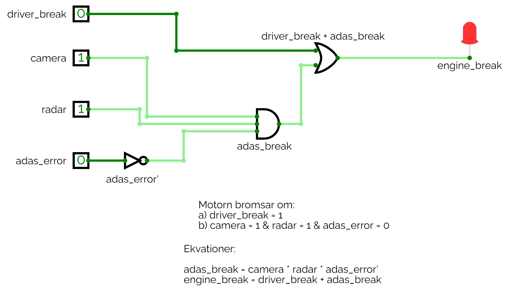
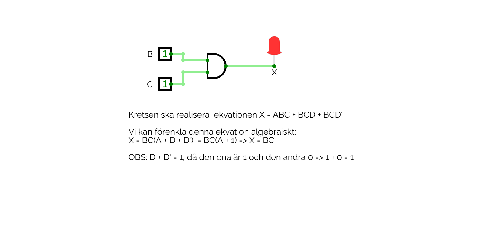

# Anteckningar 2025-02-14

Grindnät samt C-kod från dagens lektion.

## Realisering av grindnätet för ADAS-systemet

ADAS-systemet realiserad via följande grindnät:



Ovanstående grindnät kan simuleras genom att öppna filen [adas.cv](./circuits/adas.cv) i [CircuitVerse](https://circuitverse.org/simulator).

## Algebraisk minimering av grindnät

Ett grindnät som skulle realisera den logiska funktionen `X = ABC + BCD + BCD` minimerades algebraiskt till `X = BC`,
vilket resulterade i följande grindnät:



Ovanstående grindnät kan simuleras genom att öppna filen [logic_minimization.cv](./circuits/logic_minimization.cv) i [CircuitVerse](https://circuitverse.org/simulator).

## Utskrift av tal på signerad och osignerad form
atalogen [print_numbers](./print_numbers/) innehåller ett C-program för utskrift av 4- och 8-bitars tal på
osignerad, signerad, binär samt hexadecimal form.

Följande hjälpfunktioner har deklarerats i headerfilen [bit_utils.h](./print_numbers/bit_utils.h):

```c
/**
 * @brief Bit utility functions.
 */
#ifndef BIT_UTILS_DEFINED
#define BIT_UTILS_DEFINED

#include <stdint.h>

/**
 * @brief Print 8-bit value in unsigned, signed, binary and hexadecimal form.
 * 
 * @param value The value to print.
 */
void print_8bit(const uint8_t value);

/**
 * @brief Print 4-bit value in unsigned, signed, binary and hexadecimal form.
 * 
 * @param value The value to print.
 */
void print_4bit(const uint8_t value);

#endif /* BIT_UTILS_DEFINED */
```

Se implementationdetaljer i motsvarande källkodsfil [bit_utils.c](./print_numbers/bit_utils.c).

I [main.c](./print_numbers/main.c) skrivs talen 6 - 10 ut på 4-bitars form, följt av att talen
126 - 130 skrivs ut på 8-bitars form.

```c
/**
 * @brief Program for print signed and unsigned values.
 */
#include <stdint.h>

#include "bit_utils.h"

/**
 * @brief Print 4- and 8-bit values in unsigned, signed, binary and hexadecimal form.
 * 
 * @return Success code 0 upon termination of the program.
 */
int main(void)
{
    // Print 4-bit values in the range 6 - 10.
    for (uint8_t value = 6U; value <= 10U; ++value) { print_4bit(value); }

    // Print 8-bit values in the range 126 - 130.
    for (uint8_t value = 126U; value <= 130U; ++value) { print_8bit(value); }
    return 0;
}
```

Programmet resulterar i följande utskrift:

```bash
--------------------------------------------------------------------------------
Unsigned: 6
Signed: 6
Binary: 0b110
Hex: 0x6
--------------------------------------------------------------------------------

--------------------------------------------------------------------------------
Unsigned: 7
Signed: 7
Binary: 0b111
Hex: 0x7
--------------------------------------------------------------------------------

--------------------------------------------------------------------------------
Unsigned: 8
Signed: -8
Binary: 0b1000
Hex: 0x8
--------------------------------------------------------------------------------

--------------------------------------------------------------------------------
Unsigned: 9
Signed: -7
Binary: 0b1001
Hex: 0x9
--------------------------------------------------------------------------------

--------------------------------------------------------------------------------
Unsigned: 10
Signed: -6
Binary: 0b1010
Hex: 0xa
--------------------------------------------------------------------------------

--------------------------------------------------------------------------------
Unsigned: 126
Signed: 126
Binary: 0b1111110
Hex: 0x7e
--------------------------------------------------------------------------------

--------------------------------------------------------------------------------
Unsigned: 127
Signed: 127
Binary: 0b1111111
Hex: 0x7f
--------------------------------------------------------------------------------

--------------------------------------------------------------------------------
Unsigned: 128
Signed: -128
Binary: 0b10000000
Hex: 0x80
--------------------------------------------------------------------------------

--------------------------------------------------------------------------------
Unsigned: 129
Signed: -127
Binary: 0b10000001
Hex: 0x81
--------------------------------------------------------------------------------

--------------------------------------------------------------------------------
Unsigned: 130
Signed: -126
Binary: 0b10000010
Hex: 0x82
--------------------------------------------------------------------------------
```