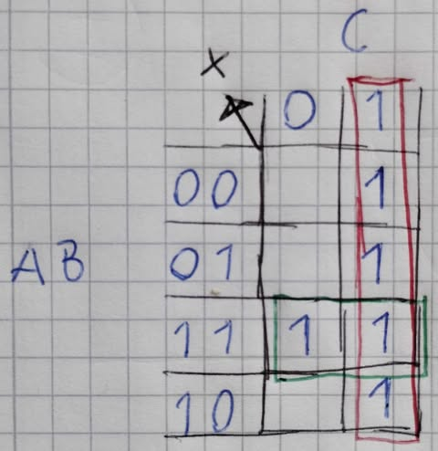
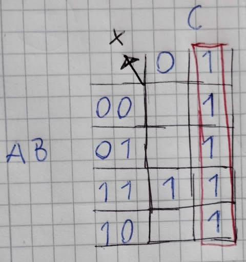
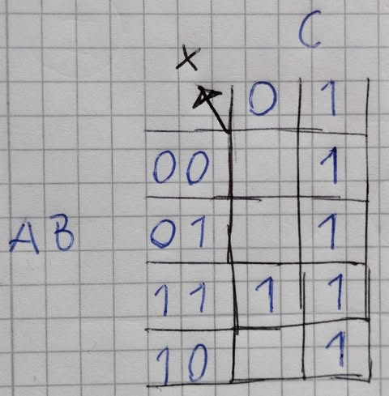
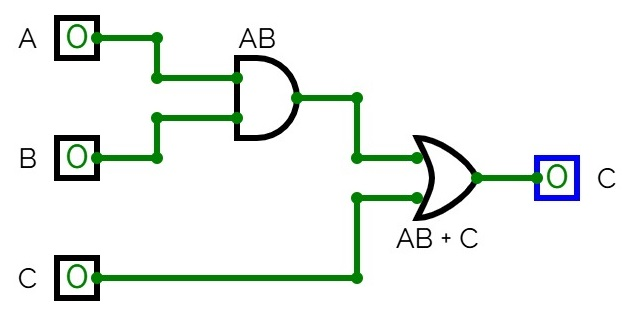

# 2025-02-21 – Lektion 3

## Dagordning
* Karnaugh-diagram för visuell minimering av logiska grindnät för hand.

## Mål med lektionen
* Kunna realisera minimerade grindnät via användning av Karnaugh-diagram. 

## Instruktioner
* Läs [Bilaga A](#bilaga-a---karnaugh-diagram) nedan för information om Karnaugh-diagram.
* Genomför gärna bifogade [övningsuppgifter](./Övningsuppgifter%202025-02-21.pdf). Lösningsförslag finns [här](./Lösningsförslag%20övningsuppgifter%202025-02-21.pdf).

## Utvärdering
* Vad tar ni med er från dagens lektion?

## Nästa lektion
* Installation av Quartus och ModelSim.
* Introduktion till VHDL – syntes och simulering av en OR-grind.

## Bilaga A - Karnaugh-diagram

Karnaugh-diagram är en metod för att visuellt förenkla booleska ekvationer, exempelvis för minimering av logiska grindnät:
* Karnaugh-diagrammet i sig utgör en tabell, där varje cell utgör en kombination av insignaler. 
* I cellen i fråga skriver man utsignalen `1` eller `0` för den givna kombinationen av insignaler.
* Vi ringar in ettor horisontellt eller vertikalt vars storlek är en potens av 2 (1, 2, 4, 8, 16 och så vidare). Grupperna kan vara horisontella eller vertikala, men inte sneda. 
* I tabellen skriver vi upp insignalerna som Gray-kod för för att säkerhetsställa att samtliga bredvidliggande celler har något gemensamt. Som exempel, med 2-bitars Gray-kod skriver vi upp signalerna i ordningen AB = 00, 01, 11, 10. Notera nu att gemensamheter mellan bredvidliggande celler, inklusive cellerna på ytterkanterna:
    * AB = 00 samt AB = 01 har gemensamt att A = 0.
    * AB = 01 samt AB = 11 har gemensamt att B = 1.
    * AB = 11 samt AB = 10 har gemensamt att A = 1.
    * AB = 10 samt AB = 00 har gemensamt att B = 0.
* Målet är att samtliga ettor ska ringas in i en grupp. Ju större block om ettor, desto mer kan vi förenkla ekvationen. Det är okej med overlapp mellan blocken.
* För varje block av ettor kontrollerar vi vad som är gemensamt. Som exempel, anta att vi har två block med ettor, `block1` samt `block2`:
    * Om alla ettor i `block1` har gemensamt att A = 0 samt B = 1 noterar vi att `block1 = A'B`. 
    * Om alla ettor i `block2` har gemensamt att C = 0 noterar vi att `block2 = C'`.
* När alla ettor har ringats in i (minst) en grupp summerar vi grupperna i en ekvation för utsignal X. För ovanstående exempel med `block1`
samt `block2` hade vi då fått följande ekvation:

```math
X = block1 + block2 = A'B + C'.
```
Vi summerar alltså samtliga grupper i ekvationen. Ekvationen är nu förenklad.

## Användning av Karnaugh-diagram

Anta att vi har ett logiskt grindnät med insignaler A, B och C samt utsignal X, vars sanningstabell visas nedan:

| A | B | C | X |
|---|---|---|---|
| 0 | 0 | 0 | 0 |
| 0 | 0 | 1 | 1 |
| 0 | 1 | 0 | 0 |
| 0 | 1 | 1 | 1 |
| 1 | 0 | 0 | 0 |
| 1 | 0 | 1 | 1 |
| 1 | 1 | 0 | 1 |
| 1 | 1 | 1 | 1 |

Vi ritar om sanningstabellen ovan till nedanstående Karnaugh-diagram:
* Vi placerar insignaler AB i y-led samt insignal C i x-led.
* Vi placerar AB i 2-bitars Grey-kod, alltså i ordningsföljden 00, 01, 11, 10, så att samtliga celler har en bit gemensam med samtliga intilliggande celler. Detta gäller även ytterkanterna, där AB = 00 samt AB = 10 har B = 0 gemensamt. Vi ser då enklare mönster och kan enkelt ringa in dessa för att erhålla en minimerad ekvation för utsignal X.
* Vi lägger till ettor i de celler där X = 1. I sanningstabellen ser vi att X = 1 för kombinationer ABC = 001, 011, 101, 110 samt 111. I övriga rutor kan vi lägga till nollor, men för att göra det enkelt kan vi strunta i detta, då vi endast är intresserad av ettorna.

Karnaugh-diagrammet kan därmed ritas ut så som visas nedan:



Vi noterar i Karnaugh-diagrammet ovan att vi får fyra ettor i kolumnen då C = `1`. Vi ringar in dessa i rött:



Som sagt har dessa ettor gemensamt att C = `1`. Därmed gäller för detta block att X = `1` då C = `1`. vilket på boolesk algrebra skrivs enligt nedan:

```math
X = C
```

Vi noterar också att vi har ett par ettor bredvid varandra på den rad då AB = `11`. Vi ringar in dessa i grönt:



Som sagt har dessa ettor gemensamt att AB = `11`, vilket på boolesk algrebra skrivs enligt nedan:

```math
X = AB
```

Eftersom samtliga ettor nu är inrutade i ett block är ekvationen slutförd. Vi summerar ekvationerna för respektive block
och erhåller då följande ekvation:

```math
X = AB + C
```

Grindnätet kan därmed realiseras via två grindar:
* En AND-grind med insignaler A och B. Utsignalen blir då AB.
* En OR-grind med insignaler AB samt C. Vi använder utsignalen ur tidigare nämnd AND-grind för att erhålla insignal AB.

Motsvarande grindnät visas nedan:



Se bifogade [övningsuppgifter](./Övningsuppgifter%202025-02-21.pdf) samt [lösningsförslag](./Lösningsförslag%20övningsuppgifter%202025-02-21.pdf) för fler exempel.