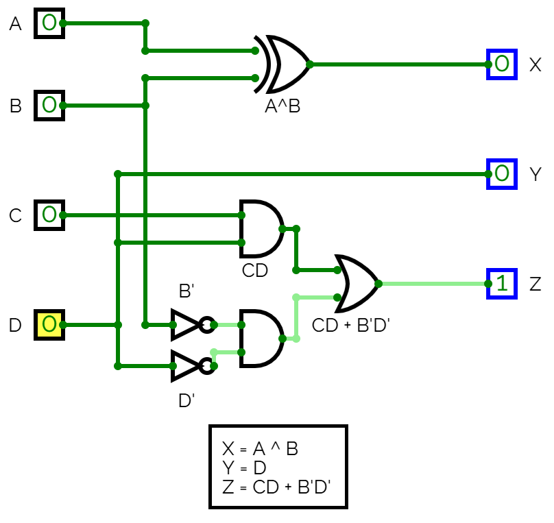
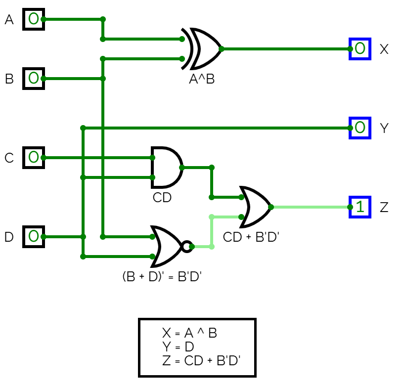

# Anteckningar 2025-03-07

Realisering av ett logiskt grindnät beskrivet [här](./../exercise/README.md).

## Ekvationer

Ekvationer för utsignaler X, Y och Z togs fram med Karnaugh-diagram. Följande ekvationer härleddes:

```bash
X = A ^ B
Y = D
Z = CD + B'D'
```

## Realiserat grindnät

Ekvationerna ovan användes för att realisera följande grindnät:



***OBS!** B'D' = (B + D), därmed kan de två NOT-grindarna med efterföljande AND-grind ersättas med en NOR-grind, såsom visas nedan:*




Ovanstående grindnät kan simuleras genom att öppna filen [net1.cv](./circuit/net1.cv) i [CircuitVerse](https://circuitverse.org/simulator).

## Syntes samt simulering i VHDL
* [net1.vhd](./vhdl/net1.vhd) innehåller modulen `net1`, som utgör själva implementationen av grindnätet.
* [net1_tb.vhd](./vhdl/net1_tb.vhd) utgör en testbänk för modulen `net1`.
* [net1.qar](./vhdl/net1.qar) utgör en arkiverad projektfil, som kan användas 
för att direkt öppna projektet, inklusive pins och testbänk, i Quartus.

## Syntes samt simulering i SystemVerilog
Motsvarande hårdvarubeskrivande kod skriven i SystemVerilog finns i underkatalogen [systemverilog](./systemverilog/):
* [net1.vhd](./systemverilog/net1.sv) innehåller modulen `net1`, som utgör själva implementationen av grindnätet.
* [net1_tb.vhd](./systemverilog/net1_tb.sv) utgör en testbänk för modulen `net1`.
* [net1.qar](./systemverilog/net1.qar) utgör en arkiverad projektfil, som kan användas 
för att direkt öppna projektet, inklusive pins och testbänk, i Quartus.