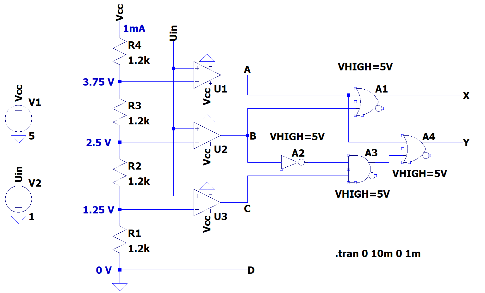

# Anteckningar 2025-03-14

Realisering av en 2-bitars AD-omvandlare, bestående av:
* En analog del innefattande en 4-nivåers spänningsdelare samt komparatorer (i form av OP-förstärkare).
* En digital del innefattande en 2-bitars prioritetsavkodare med insignaler A, B, C och D samt utsignaler X och Y.

## Ekvationer

Ekvationer för prioritetsavkodarens utsignaler X och Y togs fram med Karnaugh-diagram. Följande ekvationer härleddes:

```
X = A + B
Y = A + B'C
```

## Realiserad krets

Ekvationerna ovan användes för att realisera AD-omvandlaren enligt nedan:



Ovanstående krets kan simuleras genom att öppna filen [adc_2bit.asc](./circuit/adc_2bit.asc) i LTspice.

## Syntes samt simulering i VHDL
* [priority_encoder.vhd](./vhdl/priority_encoder.vhd) innehåller modulen `priority_encoder`, som utgör själva implementationen av prioritetsavkodaren.
* [priority_encoder_tb.vhd](./vhdl/priority_encoder_tb.vhd) utgör en testbänk för modulen `priority_encoder`.
* [priority_encoder.qar](./vhdl/priority_encoder.qar) utgör en arkiverad projektfil, som kan användas 
för att direkt öppna projektet, inklusive pins och testbänk, i Quartus.

## Syntes samt simulering i SystemVerilog
Motsvarande hårdvarubeskrivande kod skriven i SystemVerilog finns i underkatalogen [systemverilog](./systemverilog/):
* [priority_encoder.sv](./systemverilog/priority_encoder.sv) innehåller modulen `priority_encoder`, som utgör själva implementationen av prioritetsavkodaren.
* [priority_encoder_tb.sb](./systemverilog/priority_encoder_tb.sv) utgör en testbänk för modulen `priority_encoder`.
* [priority_encoder.qar](./systemverilog/priority_encoder.qar) utgör en arkiverad projektfil, som kan användas 
för att direkt öppna projektet, inklusive pins och testbänk, i Quartus.