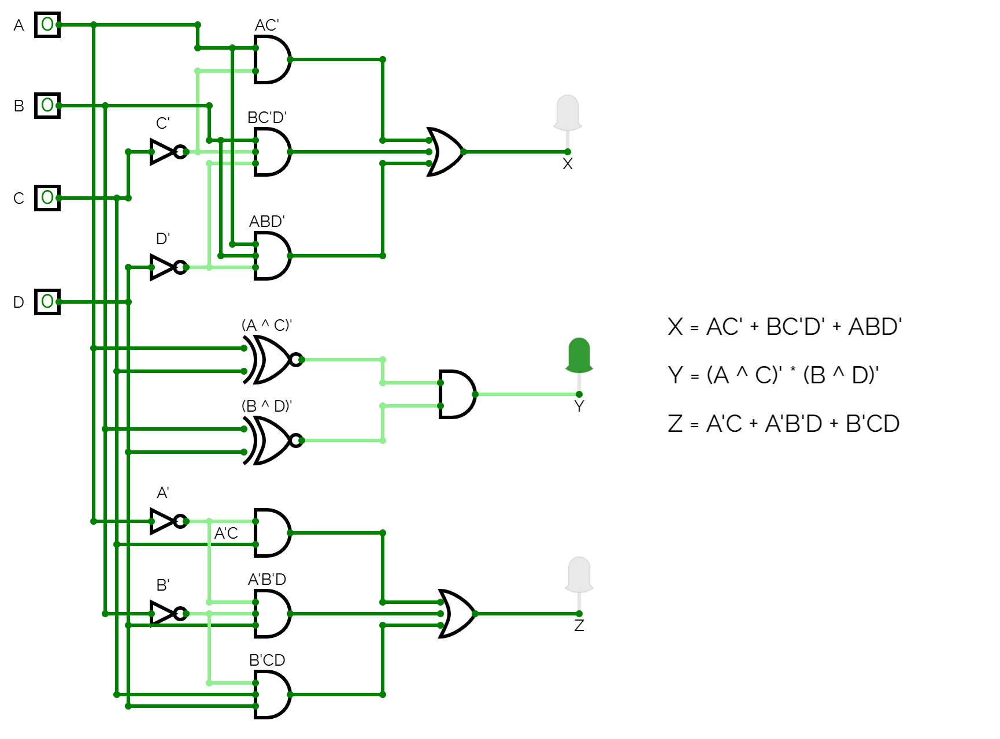

# Anteckningar 2025-03-21

Realisering av en 4-bitars komparator med insignaler ABCD samt utsignaler XYZ.

## Funktion
* AB > CD => XYZ = 100
* AB = CD => XYZ = 010
* AB < CD => XYZ = 001

## Ekvationer

Ekvationer för komparatorns utsignaler XYZ togs fram med Karnaugh-diagram. Följande ekvationer härleddes:

```
X = AC' + BC'D' + ABD'
Y = (A ^ C)' * (B ^ D)'
Z = A'C + A'B'D + B'CD
```

## Realiserad krets

Ekvationerna ovan användes för att realisera komparatorn enligt nedan:



Ovanstående krets kan simuleras genom att öppna filen [comparator_4bit.asc](./circuit/comparator_4bit.cv) 
i [CircuitVerse](https://circuitverse.org/simulator).

## Syntes samt simulering i VHDL
* [comparator_4bit.vhd](./vhdl/comparator_4bit.vhd) innehåller modulen `comparator_4bit`, 
som utgör själva implementationen av komparatorn.
* [comparator_4bit_tb.vhd](./vhdl/comparator_4bit_tb.vhd) utgör en testbänk för modulen `comparator_4bit`.
* [comparator_4bit.qar](./vhdl/comparator_4bit.qar) utgör en arkiverad projektfil, som kan användas 
för att direkt öppna projektet, inklusive pins och testbänk, i Quartus.

## Syntes samt simulering i SystemVerilog
Motsvarande hårdvarubeskrivande kod skriven i SystemVerilog finns i underkatalogen [systemverilog](./systemverilog/):
* [comparator_4bit.sv](./systemverilog/comparator_4bit.sv) innehåller modulen `comparator_4bit`, som utgör själva implementationen av komparatorn.
* [comparator_4bit_tb.sb](./systemverilog/comparator_4bit_tb.sv) utgör en testbänk för modulen `comparator_4bit`.
* [comparator_4bit.qar](./systemverilog/comparator_4bit.qar) utgör en arkiverad projektfil, som kan användas 
för att direkt öppna projektet, inklusive pins och testbänk, i Quartus.