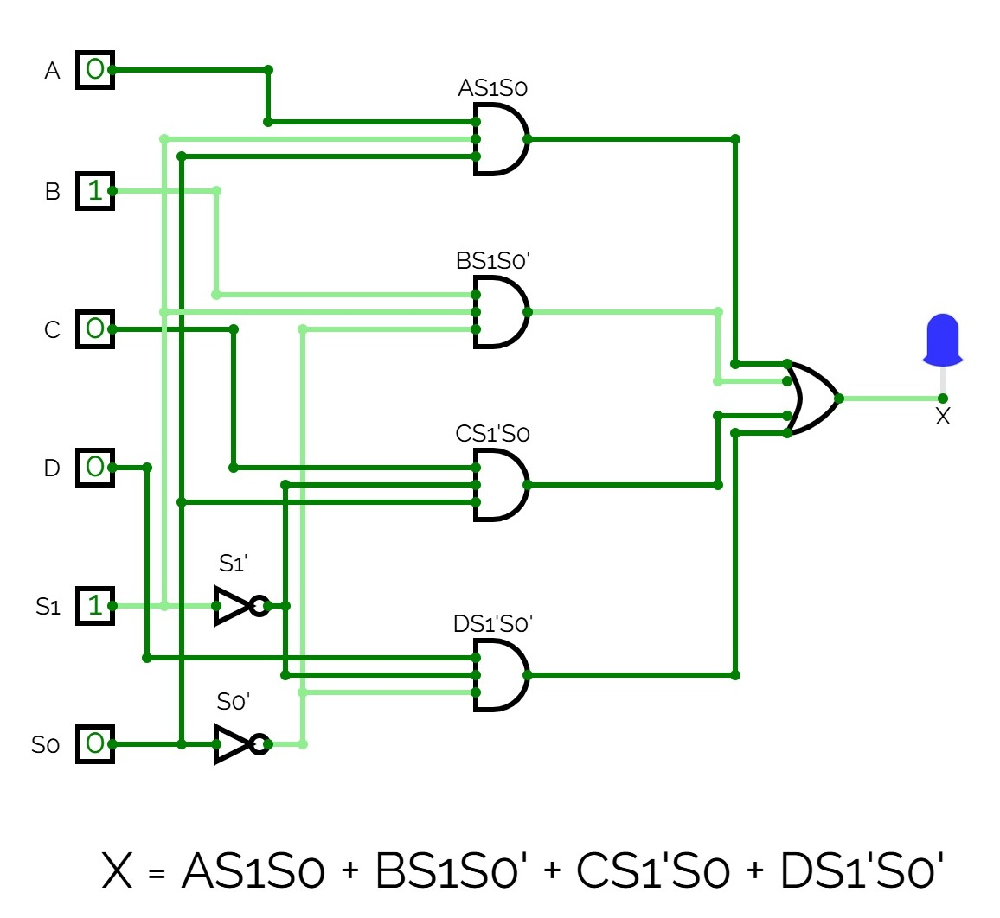

# Anteckningar 2025-03-28

Realisering av en 4-bitars multiplexer (vanligtvis kallad `4-to-1 MUX`) med insignaler `ABCD`, 
selektorsignaler `S1S0` samt utsignal `X`.

## Funktion
```
* X = A om S1S0 = 11
* X = B om S1S0 = 10
* X = C om S1S0 = 01
* X = D om S1S0 = 00
* X = 0 för övriga fall (exempelvis om något går fel)
```

## Ekvationer

Ekvationer för multiplexern XYZ härleddes via ovanstående funktionsbeskrivning:

```
X = AS1S0 + BS1S0' + CS1'S0 + DS1'S0'
```

## Realiserad krets

Ekvationerna ovan användes för att realisera multiplexern enligt nedan:



Ovanstående krets kan simuleras genom att öppna filen [mux_4bit.cv](./circuit/mux_4bit.cv) 
i [CircuitVerse](https://circuitverse.org/simulator).

## Syntes samt simulering i VHDL
* [mux_4bit.vhd](./vhdl/mux_4bit.vhd) innehåller modulen `mux_4bit`, som utgör själva implementationen av multiplexern.
* [mux_4bit_tb.vhd](./vhdl/mux_4bit_tb.vhd) utgör en testbänk för modulen `mux_4bit`.
* [mux_4bit.qar](./vhdl/mux_4bit.qar) utgör en arkiverad projektfil, som kan användas 
för att direkt öppna projektet, inklusive pins och testbänk, i Quartus.

## Syntes samt simulering i SystemVerilog
Motsvarande hårdvarubeskrivande kod skriven i SystemVerilog finns i underkatalogen [systemverilog](./systemverilog/):
* [mux_4bit.sv](./systemverilog/mux_4bit.sv) innehåller modulen `mux_4bit`, som utgör själva implementationen av multiplexern.
* [mux_4bit_tb.sv](./systemverilog/mux_4bit_tb.sv) utgör en testbänk för modulen `mux_4bit`.
* [mux_4bit.qar](./systemverilog/mux_4bit.qar) utgör en arkiverad projektfil, som kan användas 
för att direkt öppna projektet, inklusive pins och testbänk, i Quartus.