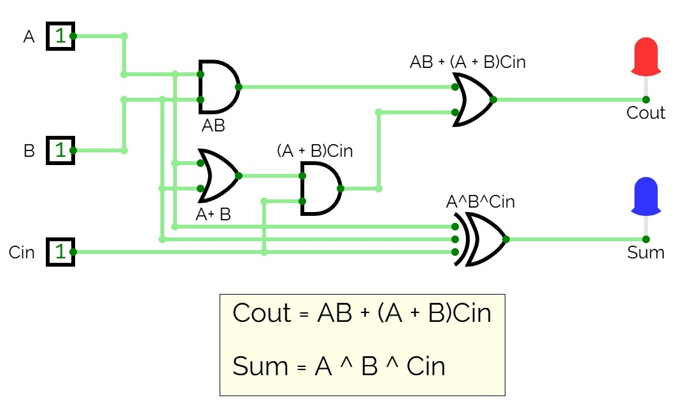

# Anteckningar 2025-04-04

Realisering av en heladderare med insignaler `{A, B, Cin}` samt utsignaler `{Cout,Sum}`.

* `Cin` och `Cout` står för *carry in* respektive *carry out* och används för att överföra bitar vid användning
av multipla räknarkretsar. Om vi exempelvis har en 8-bitars räknare behövs åtta räknarkretsar. När den given räknare *n* får overflow,
exempelvis via A + B = 1 + 1 = 10, så får vi en carry-bit. Denna bit sätts på utgången `Cout`, dvs. det är
en carry-bit ut ur räknaren. Denna carry-bit skickas då till nästa räknares `Cin`, därmed räknas denna med
i summan beräknad nästa räknare. 

Detta kan även ses vid binär addition, här av talen 5 (0101) samt 3 (0011), som hade kunnat realiseras via
fyra räknarkretsar:

```
  0101
+ 0111
  ----   
```

När vi adderar de minst signifikanta bitarna får vi 1 + 1 = 10. Summan av den första räknaren är då 0,
varvid vi får en carry-bit över till nästa beräkning. Vi skriver värdet av carry-bitarna i nedanstående
beräkning:

```
  011
  0101
+ 0011
  ----
  0100   
```

## Funktion

Följande ekvation beskriver heladdererans funktion:

```math
{Cout, Sum} = A + B + Cin
```

Därmed gäller att

```math
{Cout, Sum} = 
\begin{cases} 
{0,0} & \text{om} A + B + Cin = 0 \\ 
{0,1} & \text{om} A + B + Cin = 1 \\ 
{1,0} & \text{om} A + B + Cin = 2 \\
{1,1} & \text{om} A + B + Cin = 3 
\end{cases}
```

## Ekvationer

Ekvationer för heladderaren härleddes via en kombination av Karnaugh-diagram samt algebra:

```
Cout = AB + (A + B)Cin
Sum = A ^ B ^ C
```

## Realiserad krets

Ekvationerna ovan användes för att realisera heladderaren enligt nedan:



Ovanstående krets kan simuleras genom att öppna filen [full_adder.cv](./circuit/full_adder.cv) 
i [CircuitVerse](https://circuitverse.org/simulator).

## Syntes samt simulering i VHDL
* [full_adder.vhd](./vhdl/full_adder.vhd) innehåller modulen `full_adder`, som utgör själva implementationen av heladderaren.
* [full_adder_tb.vhd](./vhdl/full_adder_tb.vhd) utgör en testbänk för modulen `full_adder`.
* [full_adder.qar](./vhdl/full_adder.qar) utgör en arkiverad projektfil, som kan användas 
för att direkt öppna projektet, inklusive pins och testbänk, i Quartus.

## Syntes samt simulering i SystemVerilog
Motsvarande hårdvarubeskrivande kod skriven i SystemVerilog finns i underkatalogen [systemverilog](./systemverilog/):
* [full_adder.sv](./systemverilog/full_adder.sv) innehåller modulen `full_adder`, som utgör själva implementationen av heladderaren.
* [full_adder_tb.sv](./systemverilog/full_adder_tb.sv) utgör en testbänk för modulen `full_adder`.
* [full_adder.qar](./systemverilog/full_adder.qar) utgör en arkiverad projektfil, som kan användas 
för att direkt öppna projektet, inklusive pins och testbänk, i Quartus.