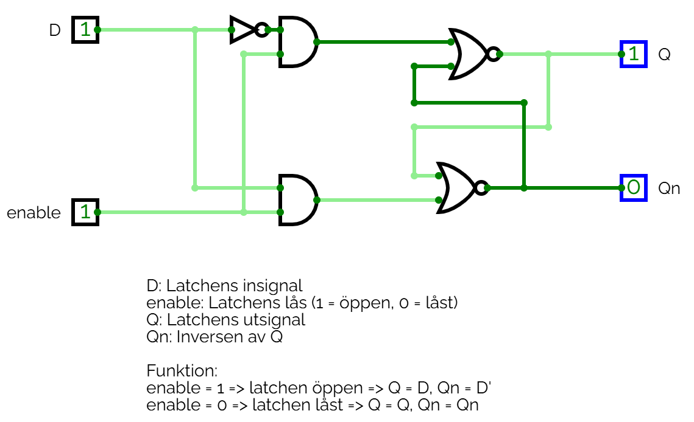
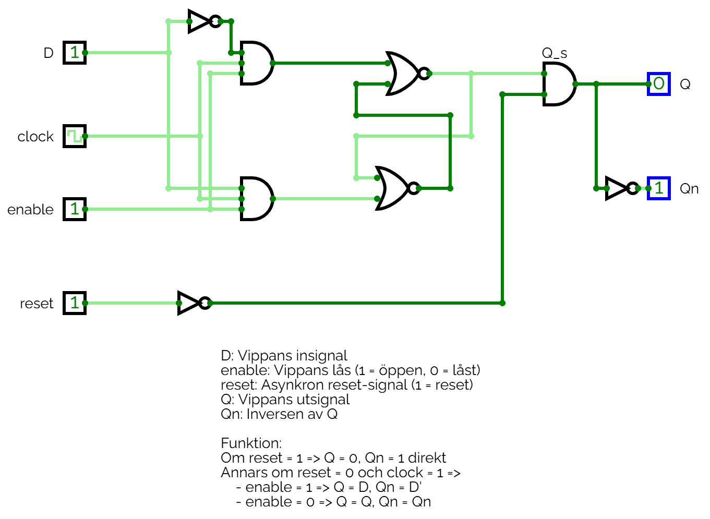
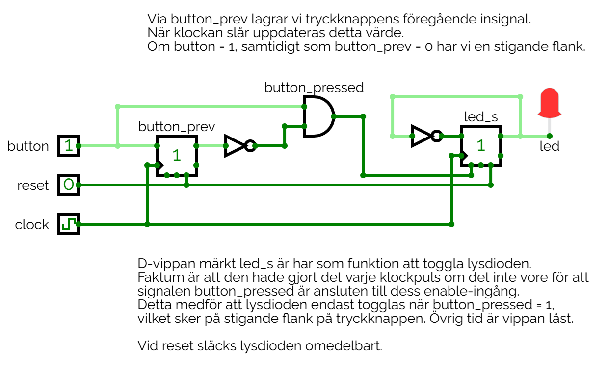

# D-latchen och D-vippan i hårdvara

## Beskrivning 
Implementering av D-latchar samt D-vippor via grindar, samt exempel på flankdetektering via D-vippor.

### D-latchen

D-latchen visas i grindform nedan:

Ovanstående krets kan simuleras genom att öppna filen [d_latch.cv](./circuits/d_latch.cv) 
i [CircuitVerse](https://circuitverse.org/simulator).

### D-vippan

D-vippan med en asynkron reset visas i grindform nedan:

Ovanstående krets kan simuleras genom att öppna filen [d_flip_flop.cv](./circuits/d_flip_flop.cv) 
i [CircuitVerse](https://circuitverse.org/simulator).

### Flankdetektering med D-vippor

Ett system där D-vippor används för att detektera stigande flank på en tryckknapp samt toggla en
lysdiod visas nedan:

Ovanstående krets kan simuleras genom att öppna filen [led_toggle.cv](./circuits/led_toggle.cv) 
i [CircuitVerse](https://circuitverse.org/simulator).