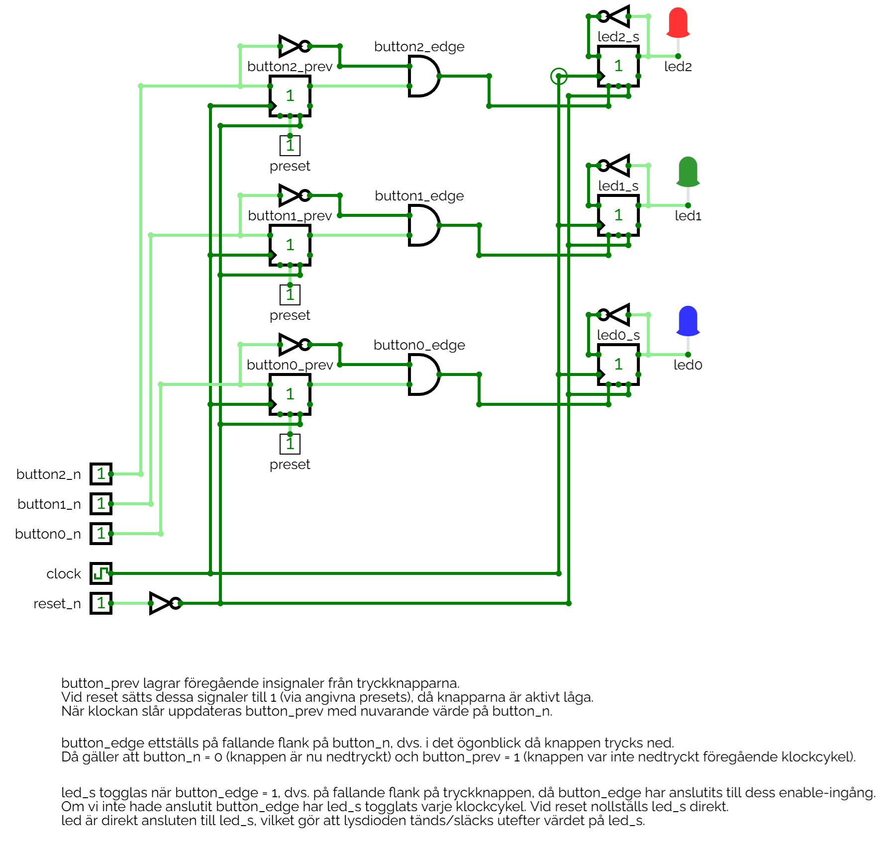

# Digitalt system med flankdetektering

## Beskrivning 
Implementering av ett digitalt system innefattande flankdetektering för toggling av tre lysdioder.

Konstruktionen innehållande följande portar:
* `clock`: Systemklocka, satt till 2 Hz i CircuitVerse, 50 MHz på FPGA-kortet.
* `reset_n`: Aktivt låg reset-signal från en tryckknapp.
* `button_n[2:0]`: Aktivt låga tryckknappar, som används för att toggla lysdioderna.
* `led[2:0]`: Lysdioder som togglas vid nedtryckning av motsvarande tryckknappar (på fallande flank).

## Kretsschema
Konstruktionens kretsschema visas nedan:

Ovanstående krets kan simuleras genom att öppna filen [led_toggle3.cv](./circuit/led_toggle3.cv) 
i [CircuitVerse](https://circuitverse.org/simulator).

## Syntes samt simulering i VHDL
* [led_toggle3.vhd](./vhdl/led_toggle3.vhd) innehåller konstruktionens toppmodul `led_toggle3`.
* [led_toggle3.qar](./vhdl/led_toggle3.qar) utgör en arkiverad projektfil, som kan användas 
för att direkt öppna projektet, inklusive pins och testbänk, i Quartus.

## Syntes samt simulering i SystemVerilog
* [led_toggle3.sv](./systemverilog/led_toggle3.sv) innehåller konstruktionens toppmodul `led_toggle3`.
* [led_toggle3.qar](./systemverilog/led_toggle3.qar) utgör en arkiverad projektfil, som kan användas 
för att direkt öppna projektet, inklusive pins och testbänk, i Quartus.