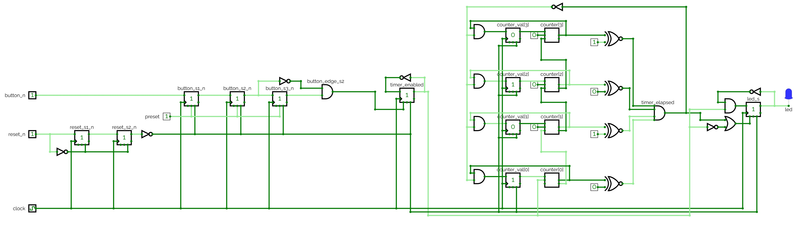
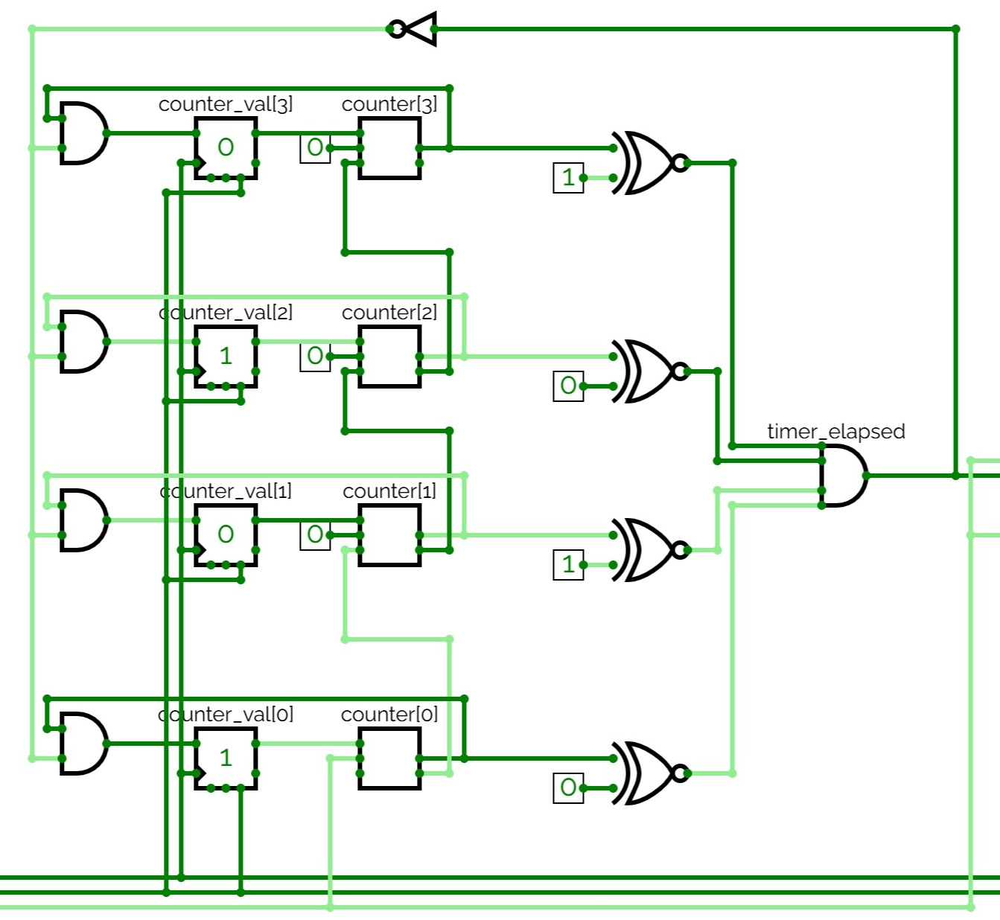
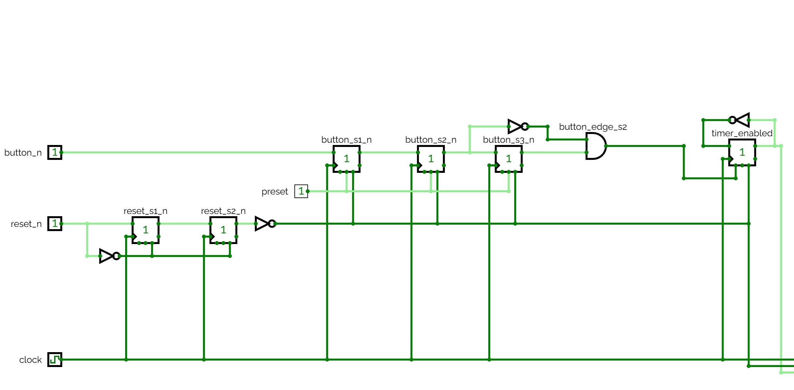
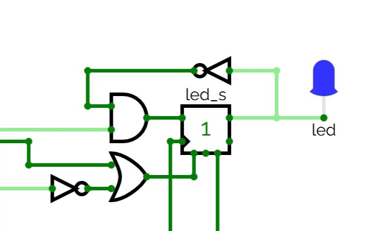

# Digital krets innehållande en timerkrets, flankdetektering och metastabilitetsskydd

## Beskrivning
Implementering av en digital krets, där en timerkrets togglas via en tryckknapp:
* När timern är aktiverad blinkar en lysdiod en gång i sekunden.
* När timern är inaktiverad hålls lysdioden släckt.

Konstruktionen innehållande följande portar:
* `clock`: Systemklocka, satt till 2 Hz i CircuitVerse, 50 MHz på FPGA-kortet.
* `reset_n`: Aktivt låg reset-signal från en tryckknapp.
* `button_n`: Aktivt låg tryckknapp, som används för att toggla timerkretsen.
* `led`: Lysdioden som togglas när timern löper ut.

## Kretsschema
Konstruktionens kretsschema visas nedan:

Ovanstående krets kan simuleras genom att öppna filen [led_toggle_timer.cv](./circuit/led_toggle_timer.cv) 
i [CircuitVerse](https://circuitverse.org/simulator).

## Detaljer

### Timerkretsen
Timern har realiserats via en 4-bitars räknare, som räknar upp till 10 innan den slår om, se nedanstående figur:

### Metastabilitetsskydd och flankdetektering
Metastabilitetsskydd har lagts till för att säkerhetsställa att samtliga insignaler är stabila (0 eller 1) när de används i konstruktionen:
* Reset-signalen `reset_n` synkroniseras via två D-vippor. Motsvarande synkroniserad reset-signal `reset_s2_n` används sedan i resten av kretsen. 
* Tryckknappen `button_n` synkroniseras via två D-vippor och ytterligare en vippa används för flankdetektering, där `button_s2_n` utgör "nuvarande" insignal och `button_s3_n` utgör "föregående" insignal. Vid nedtryckning (fallande flank) gäller att `button_s2_n` = 0 och `button_s3_n` = 1. Då ettställs signalen `button_edge_s2` för att indikera knapptryckning.
När `button_edge_s2` ettställs togglas timerkretsen, se signalen `timer_enabled`.

Denna del av kretsen visas nedan:

### Toggling av lysdioden
Lysdioden togglas när timern är aktiverad och löper ut. Om timern är inaktiverad eller vid reset nollställs lysdioden.

Denna del av kretsen visas nedan:

